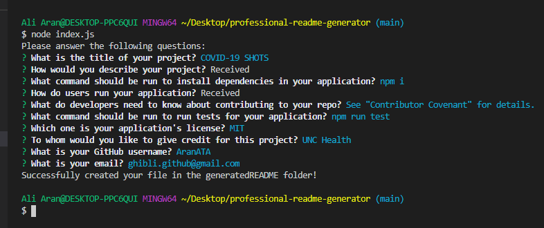
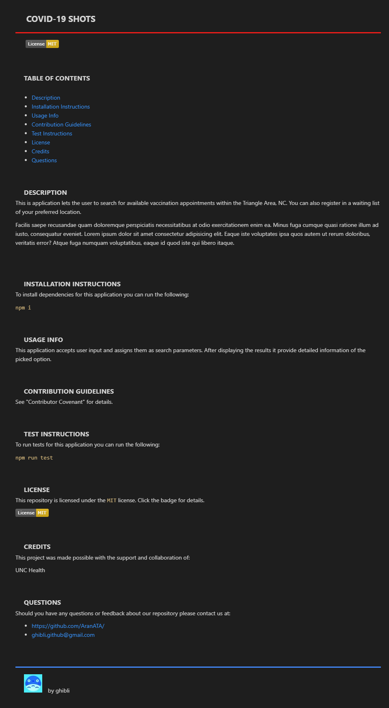

 

## **professional README generator** 
 
 

## description

***
This is a command-line application that dynamically generates a professional README.md file from a user's input using the Inquirer package. The application will be invoked by using the following command: `node index.js`. After receiving the answers the application creates a README.md file in the generatedREADME folder. Each subsequent generation will overwrite the existing README file.  

 
 

## acceptance criteria

***

The codebase achieves the following criteria: 

* GIVEN a command-line application that accepts user input: 
* WHEN I am prompted for information about my application repository; THEN a high-quality, professional README.md is generated with the title of my project and sections entitled Description, Table of Contents, Installation, Usage, License, Contributing, Tests, and Questions 
* WHEN I enter my project title; THEN this is displayed as the title of the README 
* WHEN I enter a description, installation instructions, usage information, contribution guidelines, and test instructions; THEN this information is added to the sections of the README entitled Description, Installation, Usage, Contributing, and Tests 
* WHEN I choose a license for my application from a list of options; THEN a badge for that license is added near the top of the README and a notice is added to the section of the README entitled License that explains which license the application is covered under 
* WHEN I enter my GitHub username; THEN this is added to the section of the README entitled Questions, with a link to my GitHub profile 
* WHEN I enter my email address; THEN this is added to the section of the README entitled Questions, with instructions on how to reach me with additional questions 
* WHEN I click on the links in the Table of Contents; THEN I am taken to the corresponding section of the README 
 
 

## usage

***

Under the link below you will find a walkthrough video that demonstrates; how a user would invoke the application from the command line, how a user would enter responses to all of the prompts in the application and a generated README.md that matches the user input and has a functioning table of contents. 
If the video appears out of focus please hit the space bar twice.

[https://drive.google.com/file/d/1tsZAYGVHpuPjQm7ea4EmjiG5606DC-g-/view](https://drive.google.com/file/d/1tsZAYGVHpuPjQm7ea4EmjiG5606DC-g-/view)

 
 

A screenshot that shows the terminal with all the prompts: 
 

 
 

A screenshot that shows the full generated README file: 
 

 
 

## some valuable references

***

These notes and links are listing some valuable references among others that I used doing this project: 
 

[https://coding-boot-camp.github.io/full-stack/github/professional-readme-guide](https://coding-boot-camp.github.io/full-stack/github/professional-readme-guide)

[https://nodejs.dev/](https://nodejs.dev/)

[https://www.npmjs.com/package//inquirer#prompt](https://www.npmjs.com/package//inquirer#prompt)

[https://shields.io/category/dependencies/](https://shields.io/category/dependencies/)

[https://www.screencastify.com/](https://www.screencastify.com/)

 
 

## credits

***

Stephen Woosley - Bootcamp Instructor 
Patrick Haberern - Bootcamp TA 
Tim Nagorski - Bootcamp TA 
Sean Walmer - Bootcamp TA 
Alexis San Javier - Bootcamp Tutor 
 
 

## license

***

This is an assigment done under a bootcamp program, it is public but please contact the publisher before you use or
change any content. 
ghibli.github@gmail.com
 
 

## badges

***

 
 
